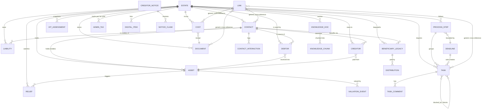

# DATA_MODEL.md

**Project:** AD Assistant | **Version:** 1.0 | **Date:** 2026-07-06 | **Status:** Canonical design master
**Source of truth:** build contract section 6; enums enriched from requirements spec v0.4 modules 1 to 19 and the data-model appendix (spec section 23)

> Public document. No personal data. Any values shown are synthetic examples.

---

## 1. Conventions (apply to every business table)

| Convention | Detail |
|---|---|
| Primary keys | UUID |
| Audit columns | `created_at`, `updated_at`, `created_by` on all business tables |
| Soft delete | `archived_at`, `archive_reason`; archiving with a reason is the only way to remove an item, nothing is hard-deleted |
| Estate scoping | every business row belongs to exactly one `estate_id` |
| Money | `Numeric` (never float); UK pounds |
| Provenance | valuations carry `valuation_source` + `valuation_date` and an estimate-or-confirmed basis; knowledge items carry `source_url`, `fetch_date`, `content_hash`, `licence`; tax constants are version-stamped (`estate.constants_version`, `iht_assessment.constants_version`) |
| Attribution | every write emits an `audit_event`; agent drafts require an `approval` record before they are final |
| Privacy | records can be flagged executor-private to hide them from the viewer role (spec section 2) |
| Validation | Pydantic v2 schemas at every API boundary |

## 2. Entity catalogue

### estate
The single root record: dates, tax constants and transfer percentages that drive the IHT engine.
Key fields: `date_of_death`, `grant_date`, `constants_version`, `nrb`, `rnrb`, `taper_threshold`, `tnrb_pct` (transferred nil-rate band percentage, 0 to 1), `trnrb_pct` (transferred residence nil-rate band percentage), `residence_to_descendants_value`, `charity_share_pct`.
Notes: constants (example values: NRB 325,000; RNRB 175,000; taper threshold 2,000,000) are sourced from the versioned knowledge library and change-flagged on refresh.

### contact
CRM record for every person and organisation, with the notification tracker built in.
Key fields: `kind` (individual | organisation), `category` (enum: bank, nsandi, insurer, pension, utility, telecom, tv_licensing, streaming, council, hmrc, probate_registry, solicitor, accountant, valuer, registrar, gp, dentist, optician, employer, landlord, care_agency, beneficiary, gift_recipient, creditor, debtor, executor, membership, other), `name`, `org`, `relationship`, `email`, `phone`, `address`, `references[]` (account or membership numbers), `holds_or_handles`, `notify_required`, `notification_status` (not_required | to_notify | notified | awaiting_response | actioned | closed), `notified_date`, `notified_method` (post | phone | online | tell_us_once), `data_protection_note`.
Notes: bulk-notification routes (Death Notification Service, Life Ledger, Settld) are tracked here as methods and contacts.

### contact_interaction
Dated log entries against a contact. Fields: `contact_id`, `date`, `channel`, `direction`, `summary`, `follow_up_date` (can spawn a task), `by_user`.

### asset
The register of everything owned, from a library card to a six-figure account.
Key fields: `category` (real_property, bank_building_society, cash, isa, nsandi_premium_bonds, quoted_shares_funds, unquoted_shares, life_policy, pension_death_benefit, vehicle, household_personal_goods, digital_online_account, membership_subscription, debt_owed_to_deceased, other), `sub_type`, `description`, `holder_contact_id`, `account_reference`, `ownership` (sole | joint_tenants | tenants_in_common), `tic_share_pct`, `dod_value` (date-of-death value), `value_basis` (estimate | confirmed), `valuation_source`, `valuation_date`, `current_or_realised_value`, `realised_date`, `income_since_death`, `iht_schedule` (auto-derived: property IHT405, accounts IHT406, goods IHT407, quoted shares IHT411, unquoted IHT412), `rnrb_qualifying` (residential interest passing to direct descendants), `passes_outside_estate` (for example joint by survivorship, nominated pension: recorded but excluded from the taxable total), `status` (identified | valuing | valued | collected | sold | transferred | distributed | archived).

### valuation_event
Valuation history per asset (retained for later CGT base cost). Fields: `asset_id`, `value`, `basis`, `source`, `date`.

### liability
What the estate owes at death. Fields: `type` (mortgage, secured_loan, unsecured_loan, credit_card, utility_arrears, care_fees, income_tax_to_death, funeral, other), `creditor_contact_id`, `amount`, `as_at_date`, `status` (identified | confirmed | settled), `iht_deductible` (genuine debts and funeral reduce the estate for IHT).

### debtor
Money owed **to** the estate, tracked to receipt. Fields: `source_contact_id`, `type` (tax_refund, pension_arrears, benefit_arrears, utility_credit, insurance_refund, premium_bond_prize, rent, dividend, other), `amount_expected`, `amount_received`, `status` (identified | claimed | awaiting | received | reconciled), `expected_date`, `received_into_asset_id`.

### creditor
Money owed **by** the estate, claim through to payment. Fields: `creditor_contact_id`, `type` (funeral, utility, care_fees, tax, credit_card, tradesman, professional_fee, other), `amount_claimed`, `amount_agreed`, `amount_paid`, `status` (identified | claim_received | verified | disputed | settled), `priority_class` (funeral | testamentary_admin | ordinary, for solvency ordering), `paid_from_asset_id`.

### creditor_notice / notice_claim
The Section 27 (Trustee Act 1925) creditor-notice workflow that protects executors before distribution.
`creditor_notice`: `gazette_ref`, `gazette_date`, `local_paper`, `local_date`, `claim_deadline` (derived: placement + 2 months), `safe_to_distribute` (derived: true only when the window is closed and creditors are settled or provisioned).
`notice_claim`: `claimant`, `amount`, `status`.
Rule: estate accounts will not mark residue safe to pay out while `safe_to_distribute` is false.

### cost
Every cost of administering the estate. Fields: `description`, `category` (probate_fee, office_copies, valuation, legal_professional, gazette_notice, insurance, property_maintenance, utilities, council_tax, travel, postage, bank_charge, indemnity_bond, other), `amount`, `vat`, `date`, `paid_by` (estate_account or a named person out of pocket), `payment_method` (estate_account | personal_card | cash), `reimbursable`, `reimbursed`, `reimbursed_date`, `iht_treatment` (funeral_deductible | admin_not_deductible: funeral reduces the estate for IHT; general admin costs do not, but do reduce residue), `receipt_document_id`.
Recording or editing a cost notifies the other executors (configurable threshold, default every cost).

### beneficiary_legacy / distribution
Who inherits what.
`beneficiary_legacy`: `beneficiary_contact_id`, `legacy_type` (pecuniary | specific | residuary), `amount_or_share` (money for pecuniary, percentage for residuary; for example a fixed pecuniary legacy to one beneficiary with the residue split by percentage among the residuary beneficiaries), `exempt_or_chargeable` (charity or spouse exempt, others chargeable), `tax_bearing` (whether the gift bears its own tax or tax falls on residue), `status` (pending | interim_paid | paid).
`distribution`: `beneficiary_legacy_id`, `amount`, `date`, `method`. Interim distributions reduce the balance due and are guarded by the creditor-notice and claims-window checks.

### task / task_comment
The spine of the tool: a living action list with dependencies.
`task`: `title`, `description`, `assignees[]`, `status` (not_started | in_progress | blocked | waiting_third_party | done | cancelled), `priority` (low | medium | high | critical), `start_date`, `due_date`, `blocked_by[]`, `blocks[]`, `checklist[]` (subtasks with done flag), `process_step_id`, `source` (manual | template | auto_deadline | agent_suggested), `reminder` (lead time before due).
Rules: a task cannot be set done while any blocking task is open; template tasks are seeded per process step and per estate contents (adding a property spawns valuation and insurance tasks); auto-deadline tasks are generated by the deadlines engine.
`task_comment`: dated notes by user.

### process_step
The ordered England-and-Wales administration timeline (18 steps, death certificate to clearance). Fields: `order`, `name`, `status` (derived from linked tasks), `deadline_id`.

### deadline
Statutory dates derived from the date of death and grant date. Fields: `type`, `derived_date`, `reminders[]`. Derivations live in `domain/deadlines.py` (see PROCESSES.md for the full table).

### document
The documents vault. Fields: `title`, `type` (death_certificate, will, grant, valuation, statement, correspondence, completed_form, receipt, notice, other), `file_key` (object storage), `mime`, `version`, `access_roles`, `links[]`. Encrypted at rest, versioned, role-restricted, access logged, soft delete only.

### iht_assessment
Immutable snapshot of each engine run. Fields: `snapshot` (JSON: allowances, taxable, tax, route, required_schedules, inputs), `constants_version`, `created_at`. Every recompute is snapshotted so the executors can see how the position and the requirements changed and why.

### relief
Reliefs and reclaims watcher. Fields: `relief_type` (iht35 share loss | iht38 land loss | rnrb_downsizing | bpr_apr), `asset_id`, `probate_value`, `sale_value`, `sale_date`, `window_deadline` (auto: death + 12 months for shares, death + 4 years for land), `potential_reclaim`, `status` (monitoring | eligible | claimed | received | not_applicable).

### admin_tax
Administration-period tax tracker. Fields: `tax_year`, `income_total`, `estate_complex` (derived from the informal-route test: estate under 2.5m, total income and CGT tax under 10,000, asset sales under 500,000 in any one tax year), `cgt_disposals[]`, `cgt_60day_deadlines[]`, `isa_exemption_end` (estate close or 3 years from death).

### digital_item
Digital assets, subscriptions and memberships. Fields: `service`, `type` (email, cloud_photos, social, subscription, membership, loyalty, domain, digital_wallet), `login_known`, `action` (cancel | memorialise | transfer | close | download), `recurring_amount` (feeds cost cancellation), `status`.

### knowledge_doc / knowledge_chunk
The cached guidance corpus.
`knowledge_doc`: `source_url`, `title`, `form_code` (for example IHT400, IHT435), `topic`, `jurisdiction`, `fetch_date`, `content_hash`, `version`, `licence` (Open Government Licence, attributed), `raw_file_key` (object storage), `extracted_text`.
`knowledge_chunk`: `knowledge_doc_id`, `text`, `embedding` (pgvector).

### notification
Co-executor alerts. Fields: `user_id`, `event_type` (cost recorded, asset added, approval needed, deadline due, re-evaluation alert, source changed), `entity_ref`, `message`, `read_at`. The viewer role is never notified.

### audit_event
Immutable log. Fields: `actor`, `action` (created | changed | viewed | approved), `entity`, `before`, `after`, `timestamp`.

### approval
The human gate. Fields: `entity_ref`, `draft_kind` (form, letter, task_suggestion, narration), `approved_by`, `approved_at`. Every agent draft creates an approval-pending record; nothing agent-produced is final without one.

### link (generic link table)
Cross-references between any two records: `from_type`, `from_id`, `to_type`, `to_id`. This is how any record links to contacts, tasks, costs and documents, so the executors can move from any item to the people, actions, money and paperwork attached to it.

## 3. Relationship overview

Audit, approval and notification attach to all entities via `entity_ref` and are omitted from the diagram for legibility.

## 4. Derivation rules embedded in the model

| Derived value | Rule |
|---|---|
| `asset.iht_schedule` | from category: property IHT405, bank/NS&I IHT406, household goods IHT407, quoted shares IHT411, unquoted shares IHT412; transfer claims add IHT402 (NRB) and IHT435/IHT436 (RNRB); gifts add IHT403 |
| Net estate for probate | sole assets + tenants-in-common share, minus IHT-deductible liabilities, minus funeral; survivorship and outside-estate assets shown but excluded |
| `creditor_notice.claim_deadline` | latest placement date + 2 months |
| `creditor_notice.safe_to_distribute` | window closed AND all claims settled or provisioned |
| `process_step.status` | rolled up from its tasks |
| `admin_tax.estate_complex` | informal-route test (see admin_tax above) |
| `relief.window_deadline` | death + 12 months (IHT35 shares), death + 4 years (IHT38 land) |
| Data completeness | proportion of asset values `confirmed` versus `estimate`, shown on the dashboard |
